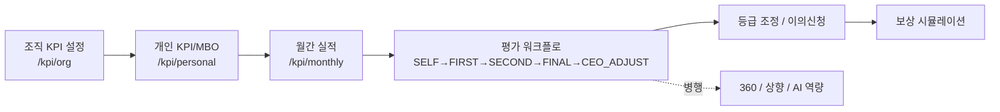
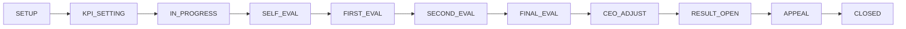

# KPI-PMS 관리자 매뉴얼 (초안)

> **상태**: draft.
> **작성 기준**: 본 매뉴얼은 코드(`src/**`, `prisma/schema.prisma`)와 운영 문서(`docs/AI_*.md`, `docs/auth-rbac-matrix.md`)에서 확인된 사실만 담는다.
> **표기 규칙**: 본문 중 `[확인 필요]`로 표기한 항목은 화면을 직접 보지 않고는 단정할 수 없는 부분(주로 정확한 입력 위젯·문구·동작 순서). 운영 전 실제 화면에서 보강한다.
> **대상 사용자**: HR/인사 관리자(`ROLE_ADMIN`).

---

## 목차

1. [시스템 개요](#1-시스템-개요)
2. [역할과 권한 매트릭스](#2-역할과-권한-매트릭스)
3. [메뉴/화면 안내](#3-메뉴화면-안내)
4. [평가 사이클 운영 (상태 전이)](#4-평가-사이클-운영-상태-전이)
5. [KPI/MBO 관리](#5-kpimbo-관리)
6. [평가자 배정](#6-평가자-배정)
7. [점수·등급 체계 (2026 정책)](#7-점수등급-체계-2026-정책)
8. [조직 점수 입력 (Department Score Intake)](#8-조직-점수-입력-department-score-intake)
9. [관리자 작업 절차 (How-to)](#9-관리자-작업-절차-how-to)
10. [문제 해결 / FAQ](#10-문제-해결--faq)
11. [부록 A — 라우트·메뉴 색인](#부록-a--라우트메뉴-색인)
12. [부록 B — 2026 정책 등급 임계값](#부록-b--2026-정책-등급-임계값)
13. [부록 C — 용어집](#부록-c--용어집)

---

## 1. 시스템 개요

### 1.1 KPI-PMS란

- **이름**: KPI-PMS (성과관리 및 평가시스템).
- **한 줄 정의**: Next.js 16 + Prisma 7 + PostgreSQL 기반의 사내(Rsupport) 통합 성과관리 플랫폼.
- **목적 (단계별)**: 조직/개인 KPI 설정 → 월별 실적 누적 → 다단계 평가(자기·1차·2차·최종·CEO 조정) → 360 피드백 / AI 역량평가 → 보상 시뮬레이션.
- **대상 사용자**: 일반 팀원, 팀장/실장/본부장, CEO, HR 관리자(`ROLE_ADMIN`).
- 출처: [CLAUDE.md](../CLAUDE.md), [docs/AI_PROJECT_CONTEXT.md](AI_PROJECT_CONTEXT.md).

### 1.2 시스템 상태 — 2026 평가제도 운영 단계

- 2026 평가제도의 **공식 데이터 쓰기**(공식 모집단 생성·공식 점수 저장·공식 등급 저장·확정·AI 점수 제외 활성화 등)는 **현재 차단 상태**다.
- 운영 중인 것: 미리보기(preview), 정책 카테고리 매핑, 점수/등급 정책 준비도(readiness) 리포트, 가드(write guard) 요약.
- 출처: [docs/AI_EVALUATION_SYSTEM_CONTEXT.md](AI_EVALUATION_SYSTEM_CONTEXT.md), [docs/AI_SAFETY_GUARDRAILS.md](AI_SAFETY_GUARDRAILS.md).

### 1.3 2026 평가제도 요지

코드에 정의된 2026 정책의 핵심 ([src/lib/evaluation-policy-2026.ts](../src/lib/evaluation-policy-2026.ts)):

- **항목 분류 4종** (`EVALUATION_POLICY_ITEM_CATEGORY_CODES`):
  - `ORG_GOAL` (조직목표, contribution=ORGANIZATION, 항목당 가중치 ≤10, 합계 ≤50)
  - `PROJECT_T` (프로젝트 T, PERSONAL, 항목당 ≤10)
  - `PROJECT_K` (프로젝트 K, PERSONAL, 항목당 ≤5)
  - `DAILY_WORK` (일상업무, PERSONAL, 잔여 비중 = 100 − 위 세 합계, 점수 상한 80)
- **등급 6단계** (`EvaluationPolicyGradeCode`): `SUPER / OUTSTANDING / EXCELLENT / GOOD / NEED_IMPROVEMENT / UNSATISFACTORY`.
- **임계 그룹 5종** (`EvaluationPolicyThresholdGroupCode`): `TEAM_MEMBER_NON_SALES`, `TEAM_SECTION_LEADER_NON_SALES`, `TEAM_MEMBER_SALES`, `TEAM_SECTION_LEADER_SALES`, `DIVISION_HEAD`. 상세 임계값은 [부록 B](#부록-b--2026-정책-등급-임계값).
- **최종 점수 산식 (예정)**: `조직 성과 30% + 개인 성과 70%` (`finalScoreFormula`). **현재 `active: false` — dormant**.
- **가감점 규칙 (예정)**: ±5점 범위, 0-sum 필수, 적용 분류는 `ORG_GOAL/PROJECT_T/PROJECT_K` (target 미달은 미적용). **`adjustmentRule.active: false` — dormant**.
- **조직목표 미달 예외 (예정)**: `ORG_GOAL`이 미달이어도, 연결된 본인 `PROJECT_T`가 target 이상이면 해당 `ORG_GOAL` 항목을 80점으로 override. **`belowTargetExceptionRule.active: false` — dormant**.
- **DAILY_WORK 점수 게이트 (예정)**: 상한 80, 팀장 재량, SELF 종료 후 단계(`FIRST/SECOND/FINAL`)에서만 입력. **`dailyWorkScoringRule.active: false` — dormant**.
- **가중치 합계 규칙 (예정)**: 총합 100 강제. **`weightRule.enforced: false` — cutover 이전엔 warning**.
- **AI 역량(Pass/Fail) (예정)**: 적용 대상 `TEAM_LEADER/MEMBER`, 제외 `SECTION_CHIEF/DIV_HEAD`, level-up 요건 시작 2028년부터. **`aiCapability.active: false` — dormant**.

> ⚠️ **운영 영향**: 위 dormant 규칙들은 cutover(예: 2026-07-01) 시 활성화 예정. 활성화 전엔 점수·등급 계산에 영향 0. cutover flag flip은 HR/엔지니어링 승인 사안.



---

## 2. 역할과 권한 매트릭스

### 2.1 시스템 역할 6종 (`AuthRole`)

출처: [src/types/auth.ts](../src/types/auth.ts) — `AUTH_ROLES`.

| 역할 코드 | 한국어 명 | 비고 |
|---|---|---|
| `ROLE_ADMIN` | HR 관리자 | 본 매뉴얼의 주 대상 |
| `ROLE_CEO` | 대표이사 | 최종 조정, 통계 열람 |
| `ROLE_DIV_HEAD` | 본부장 | 최종(FINAL) 평가자, 본부 단위 |
| `ROLE_SECTION_CHIEF` | 실장 | 2차(SECOND) 평가자 |
| `ROLE_TEAM_LEADER` | 팀장 | 1차(FIRST) 평가자 |
| `ROLE_MEMBER` | 팀원 | 자기(SELF) 평가자 |

### 2.2 조직 범위(scope) 기본값

출처: [docs/auth-rbac-matrix.md](auth-rbac-matrix.md).

- `ROLE_ADMIN`, `ROLE_CEO`: 전 부서 접근.
- `ROLE_DIV_HEAD`, `ROLE_SECTION_CHIEF`, `ROLE_TEAM_LEADER`: 본인 부서 + 하위 부서.
- `ROLE_MEMBER`: 본인 레코드만.

세션에는 `accessibleDepartmentIds` 배열이 포함되어 위 범위가 강제됨 ([src/types/auth.ts:48](../src/types/auth.ts#L48)).

### 2.3 메뉴 권한 매트릭스 (전체 29개 메뉴키)

출처: [src/lib/auth/permissions.ts](../src/lib/auth/permissions.ts) — `MENU_PERMISSIONS`. `O` = 접근 가능.

| 메뉴키 | ADMIN | CEO | DIV_HEAD | SECTION_CHIEF | TEAM_LEADER | MEMBER |
|---|:---:|:---:|:---:|:---:|:---:|:---:|
| `DASHBOARD` | O | O | O | O | O | O |
| `STATISTICS` | O | O | | | | |
| `KPI_SETTING` | O | O | O | O | O | O |
| `ORG_KPI_UPLOAD` | O | O | O | O | O | O |
| `PERSONAL_KPI_UPLOAD` | O | | | | O | |
| `MONTHLY_INPUT` | O | | | | O | O |
| `SELF_EVAL` | | | | | | O |
| `EVAL_1ST` | O | | | | O | |
| `EVAL_2ND` | O | | | O | | |
| `EVAL_FINAL` | O | | O | | | |
| `GRADE_ADJUST` | O | O | | | | |
| `EVAL_RESULT` | O | O | O | O | O | O |
| `APPEAL` | O | O | O | O | O | O |
| `FEEDBACK_360` | O | O | O | O | O | O |
| `WORD_CLOUD_360` | O | O | O | O | O | O |
| `PERFORMANCE_EVALUATION` | O | O | O | O | O | O |
| `AI_COMPETENCY` | O | O | O | O | O | O |
| `CHECKIN` | O | O | O | O | O | O |
| `NOTIFICATIONS` | O | O | O | O | O | O |
| `AI_ASSIST` | O | O | O | O | O | O |
| `COMPENSATION_SELF` | O | O | O | O | O | O |
| `COMPENSATION_MANAGE` | O | O | O | | | |
| `ORG_MANAGE` | O | | | | | |
| `ORG_UPLOAD` | O | | | | | |
| `GRADE_SETTING` | O | | | | | |
| `EVAL_CYCLE` | O | | | | | |
| `DEPARTMENT_SCORE_INTAKE` | O | | | | | |
| `AUDIT_LOG` | O | | | | | |
| `SYSTEM_SETTING` | O | | | | | |

> 표 해석: 1차 평가자는 팀장, 2차는 실장, 최종은 본부장으로 코드 레벨에서 강제된다. 관리자(`ROLE_ADMIN`)는 모든 평가 단계 메뉴에도 접근 가능 — 백업/대행 시나리오.

### 2.4 인증·세션 관련 운영 제약

출처: [docs/auth-rbac-matrix.md](auth-rbac-matrix.md) "Current limits".

- Credentials 로그인은 **비상 관리자 경로**이며 env 기반(비밀번호 해시 DB 흐름 아님).
- 비밀번호 재설정 / 로그인 실패 잠금 / GWS 동기화는 **미구현**.
- 일부 구버전 라우트에 로컬 role 검사가 남아 있어 단계적 통합 대상 — `[확인 필요]` (운영 중 불일치 발견 시 보고).

---

## 3. 메뉴/화면 안내

### 3.1 전체 메뉴 트리 (관리자 기준)

출처: [src/lib/navigation.ts](../src/lib/navigation.ts) — `NAV_ITEMS`. 관리자에게 보이는 모든 메뉴.

```mermaid
flowchart TB
  ROOT[관리자 메뉴]
  ROOT --> M1[대시보드<br/>/dashboard]
  ROOT --> M2[통계<br/>/statistics]
  ROOT --> M3[KPI/MBO]
  M3 --> M3a[조직 KPI · /kpi/org]
  M3 --> M3b[내 KPI/MBO · /kpi/personal]
  M3 --> M3c[팀원 KPI 검토 · /kpi/personal?tab=review]
  M3 --> M3d[월간 실적 · /kpi/monthly]
  ROOT --> M4[평가]
  M4 --> M4a[HR 평가 운영 대시보드 · /evaluation/performance]
  M4 --> M4b[평가 워크벤치 미리보기 · /evaluation/workbench]
  M4 --> M4c[AI 역량평가 · /evaluation/ai-competency]
  M4 --> M4d[360 다면평가 · /evaluation/360]
  M4 --> M4e[상향 평가 · /evaluation/upward/respond]
  M4 --> M4f[상향 평가 운영 · /evaluation/upward/admin]
  M4 --> M4g[워드클라우드 다면평가 · /evaluation/word-cloud-360]
  M4 --> M4h[평가 결과 · /evaluation/results]
  M4 --> M4i[이의 요청 · /evaluation/appeal]
  M4 --> M4j[대표이사 확정 · /evaluation/ceo-adjust]
  ROOT --> M5[체크인 · /checkin]
  ROOT --> M6[알림 · /notifications]
  ROOT --> M7[관리자]
  M7 --> A1[평가 운영 허브 · /admin/evaluation-ops]
  M7 --> A2[평가 배정 · /admin/performance-assignments]
  M7 --> A3[성과 관리 일정 · /admin/performance-calendar]
  M7 --> A4[공식 전환 준비 · /admin/evaluation-readiness]
  M7 --> A5[조직도 관리 · /admin/google-access?tab=org-chart]
  M7 --> A6[평가 주기 · /admin/eval-cycle]
  M7 --> A7[조직 점수 입력 · /admin/department-score-intake]
  M7 --> A8[등급 설정 · /admin/grades]
  M7 --> A9[성과 체계 · /admin/performance-design]
  M7 --> A10[성과 얼라인먼트 · /admin/goal-alignment]
  M7 --> A11[Google 계정 등록 · /admin/google-access]
  M7 --> A12[알림 운영 · /admin/notifications]
  M7 --> A13[운영/시스템 관리 · /admin/ops]
```



### 3.2 화면별 요지

> 각 화면의 페이지 제목(`<h1>`) 또는 안내 카피는 코드에서 확인된 그대로 기재했다. 화면 세부 위젯은 `[확인 필요]`.

| 화면 | 경로 | 페이지 제목 | 주요 용도 |
|---|---|---|---|
| HR 평가 운영 대시보드 | `/evaluation/performance` | 성과평가 | MBO/KPI 작성, 리더 검토, 정책 분류, 평가자 배정 blocker 일일 점검 |
| 평가 워크벤치 미리보기 | `/evaluation/workbench` | 성과평가 / "2026 평가 워크벤치 미리보기" | KPI 표·단계별 미리보기·점수/등급 미리보기·안전 패널. `localScorePreview`로 30:70 산식 + 자동등급 라벨이 실시간 노출되나 **공식 저장 비활성**(미리보기 전용). |
| 평가 운영 허브 | `/admin/evaluation-ops` | 2026 MBO/KPI 운영 허브 | 7/1 MBO 오픈 시 자주 쓰는 화면 모음. **이 허브 자체엔 쓰기 버튼이 없음** |
| 평가 배정 운영 | `/admin/performance-assignments` | 평가 배정 관리 / 평가 배정 운영 | FIRST/SECOND/FINAL 평가자 누락·routing blocker 점검 |
| 성과 관리 일정 | `/admin/performance-calendar` | 성과 관리 일정 | MBO 오픈, 월간 실적, 리더 검토 일정 관리 |
| 공식 전환 준비 | `/admin/evaluation-readiness` | (Workbench 컴포넌트 재사용) | Baseline 내보내기, policyCategory 정리, 공식 저장 차단 상태 — read-only |
| 조직도 관리 | `/admin/google-access?tab=org-chart` | 조직도 관리 | 부서 계층, 사번-부서 매핑 |
| 평가 주기 | `/admin/eval-cycle` | 평가 주기 관리 | EvalCycle CRUD (연/반기/분기) |
| 조직 점수 입력 | `/admin/department-score-intake` | 조직 점수 입력 | 부서/조직 점수 입력 (read-only 준비) |
| 등급 설정 | `/admin/grades` | 평가 등급 설정 | 연도별 등급 임계값 / 권장 분포 |
| 성과 체계 | `/admin/performance-design` | 성과 설계 | 평가 항목 카테고리/정책 설계 — `[확인 필요]` 상세 동작 |
| 성과 얼라인먼트 | `/admin/goal-alignment` | (연도)년 목표 얼라인먼트 | 조직-개인 목표 정렬 |
| Google 계정 등록 | `/admin/google-access` | Google 계정 등록 관리 | OAuth 이메일 ↔ 사번 매핑 |
| 알림 운영 | `/admin/notifications` | 알림 운영 | 템플릿/큐/디스패치/재시도/데드레터 |
| 운영 / 관제 | `/admin/ops` | 운영 / 관제 | Job 실행, 헬스체크, 운영 메트릭, 감사 로그 |

[스크린샷: 관리자 메뉴 전체 트리]
[스크린샷: /admin/evaluation-ops 허브]

---

## 4. 평가 사이클 운영 (상태 전이)

### 4.1 `CycleStatus` 11단계

출처: [prisma/schema.prisma:671](../prisma/schema.prisma#L671).



| 단계 | 의미 | 관리자 주요 조작 |
|---|---|---|
| `SETUP` | 사이클 설정 | `/admin/eval-cycle`에서 사이클 생성, 일정 등록 |
| `KPI_SETTING` | KPI 설계 기간 | 조직 KPI 등록, 성과 얼라인먼트 확인 |
| `IN_PROGRESS` | 실적 누적 | 월간 실적 입력 모니터링 |
| `SELF_EVAL` | 자기평가 | 자기평가 진행률 모니터링 |
| `FIRST_EVAL` | 1차(팀장) 평가 | 평가자 배정/누락 점검 |
| `SECOND_EVAL` | 2차(실장) 평가 | 동일 |
| `FINAL_EVAL` | 최종(본부장) 평가 | 동일 |
| `CEO_ADJUST` | CEO 조정 | `/evaluation/ceo-adjust`로 최종 등급 조정 |
| `RESULT_OPEN` | 결과 공개 | `/evaluation/results` 공개 |
| `APPEAL` | 이의신청 접수 | `/evaluation/appeal` 운영 |
| `CLOSED` | 마감 | 사이클 종료, 다음 사이클 셋업 |

> 위 표의 "관리자 주요 조작"은 일반적 운영 흐름 추정 — 실제 화면별 활성 버튼·전이 트리거는 `[확인 필요]` (각 화면의 UI에서 검증).

### 4.2 평가 단계 (`EvalStage`) — 한 사람의 평가 흐름

출처: [prisma/schema.prisma:851](../prisma/schema.prisma#L851).


### 4.3 평가 상태 (`EvalStatus`)

출처: [prisma/schema.prisma:859](../prisma/schema.prisma#L859).

- `PENDING` → 시작 전.
- `IN_PROGRESS` → 진행 중 (`isDraft=true`).
- `SUBMITTED` → 제출 완료 (`submittedAt` 기록).
- `REJECTED` → 반려 (`isRejected=true`, `rejectionReason` 기록).
- `CONFIRMED` → 확정.

> 반려 흐름: 코드 상 `isRejected`/`rejectedAt`/`rejectionReason` 필드 존재. 반려 후 재제출 UI는 `[확인 필요]`.

### 4.4 핵심 도메인 모델 (요약)

출처: [CLAUDE.md](../CLAUDE.md) §5.

- `EvalCycle` ─< `Evaluation` ─< `EvaluationItem` (KPI별 점수).
- `EvaluationAssignment`: 평가자↔피평가자 자동/수동 배정 (`source: AUTO | MANUAL`).
- `Evaluation`: `totalScore`, `gradeId`, `policyFormulaVersion`, `organizationPerformanceScore`, `personalPerformanceScore`, `aiScoreIncludedInTotal`, `scorePolicySnapshot` 등 보유 ([prisma/schema.prisma:815](../prisma/schema.prisma#L815)).
- `Appeal`: 이의 신청.

### 4.5 ★ 운영 안전 경계

출처: [docs/AI_SAFETY_GUARDRAILS.md](AI_SAFETY_GUARDRAILS.md) — "Absolute Prohibited Actions".

다음은 **명시적 승인 없이 실행 금지**:
- 운영 DB 변경, 마이그레이션 실행.
- `Evaluation.totalScore` / `Evaluation.gradeId` 공식 쓰기.
- 공식 `Evaluation` / `EvaluationItem` 레코드 생성.
- 공식 점수/등급/AI 점수 제외 feature flag 활성화.
- backfill `--apply`.
- 운영 alias(`https://kpi-pms.vercel.app`) 전환.

> `/admin/evaluation-ops` 페이지에는 의도적으로 위 액션 버튼이 없으며, 화면 하단에 안전 경계 안내가 표시된다 ([src/app/(main)/admin/evaluation-ops/page.tsx:119](../src/app/(main)/admin/evaluation-ops/page.tsx#L119)).

---

## 5. KPI/MBO 관리

### 5.1 조직 KPI (`/kpi/org`)

- 페이지 제목: "조직 KPI" ([src/components/kpi/OrgKpiManagementClient.tsx:1607](../src/components/kpi/OrgKpiManagementClient.tsx#L1607)).
- 권한: `ORG_KPI_UPLOAD` — **전체 역할 가능**(단, scope에 따라 보이는 부서가 다름).
- 모델: `OrgKpi`. `parentOrgKpiId`로 계층 정렬, `copiedFromOrgKpiId`로 복제 추적, `targetValueT/E/S` 3단 목표(Target/Excellent/Super) ([CLAUDE.md §5](../CLAUDE.md) KPI 섹션).
- AI 추천: `TeamKpiRecommendationSet/Item` + `TeamKpiReviewRun/Item` — **preview-first + approval-based** 패턴. 결과는 화면에 미리 보여주고 사용자 승인 시에만 반영.

### 5.2 내 KPI/MBO (`/kpi/personal`)

- 페이지 제목: "내 KPI/MBO" ([src/components/kpi/PersonalKpiManagementClient.tsx:2449](../src/components/kpi/PersonalKpiManagementClient.tsx#L2449)).
- 권한: `KPI_SETTING` — 전체 역할 가능. `PERSONAL_KPI_UPLOAD`는 `ROLE_ADMIN` + `ROLE_TEAM_LEADER`.
- 탭 `?tab=review`: 팀원 KPI 검토 모드(리더 전용 메뉴 entry로 노출되지만 permission 자체는 `KPI_SETTING` 공통).

### 5.3 월간 실적 (`/kpi/monthly`)

- 페이지 제목: 동적(`monthContext.screenTitle`).
- 권한: `MONTHLY_INPUT` — `ROLE_ADMIN`, `ROLE_TEAM_LEADER`, `ROLE_MEMBER` (실장·본부장·CEO 제외).
- 모델: `MonthlyRecord` — 달성률 자동 계산. 계산 함수 `calcAchievementRate` ([src/lib/utils.ts:73](../src/lib/utils.ts#L73)).

### 5.4 점수 계산 함수 (참조 위치)

출처: [CLAUDE.md §6](../CLAUDE.md).

| 무엇 | 어디 |
|---|---|
| KPI 달성률 | [src/lib/utils.ts:73](../src/lib/utils.ts#L73) `calcAchievementRate` |
| PDCA 점수 (P30·D40·C20·A10) | [src/lib/utils.ts:78](../src/lib/utils.ts#L78) `calcPdcaScore` |
| 가중치 적용 점수 | [src/lib/utils.ts:87](../src/lib/utils.ts#L87) `calcWeightedScore` |
| 평가 가중평균 | [src/server/evaluation-results-scoring.ts:6](../src/server/evaluation-results-scoring.ts#L6) `weightedAverage` |
| 성과+역량 최종점수 | [src/server/evaluation-results-scoring.ts:30](../src/server/evaluation-results-scoring.ts#L30) `calculateEffectiveTotalScore` |
| AI 역량 최종점수 | [src/lib/ai-competency-scoring.ts:22](../src/lib/ai-competency-scoring.ts#L22) `calculateAiCompetencyFinalScore` |
| AI 역량 등급 (S/A/B/C/D) | [src/lib/ai-competency-scoring.ts:37](../src/lib/ai-competency-scoring.ts#L37) `calculateAiCompetencyGrade` |

[스크린샷: /kpi/org 화면]
[스크린샷: /kpi/personal 화면]
[스크린샷: /kpi/monthly 화면]

---

## 6. 평가자 배정

### 6.1 화면

- 경로: `/admin/performance-assignments`.
- 페이지 제목: "평가 배정 관리" / "평가 배정 운영" ([src/components/admin/PerformanceAssignmentAdminClient.tsx:183](../src/components/admin/PerformanceAssignmentAdminClient.tsx#L183), [:464](../src/components/admin/PerformanceAssignmentAdminClient.tsx#L464)).
- 권한: `EVAL_CYCLE` (`ROLE_ADMIN` 전용).
- 용도: "FIRST / SECOND / FINAL 평가자 누락과 routing blocker를 확인합니다" ([src/app/(main)/admin/evaluation-ops/page.tsx:13](../src/app/(main)/admin/evaluation-ops/page.tsx#L13)).

### 6.2 데이터 모델

- `EvaluationAssignment` — `evalCycleId × targetId × evalStage`. `source: AUTO | MANUAL`.
- 자동 배정 룰의 기본 매핑(코드 매트릭스 기준):
  - `FIRST` 평가자: 팀장 (`ROLE_TEAM_LEADER`).
  - `SECOND` 평가자: 실장 (`ROLE_SECTION_CHIEF`).
  - `FINAL` 평가자: 본부장 (`ROLE_DIV_HEAD`).
- 자동 배정 알고리즘 상세(매니저 체인 사용 여부 등)는 `[확인 필요]` — `Employee.managerId / teamLeaderId / sectionChiefId / divisionHeadId` 4중 체인이 모델에 존재하나, 실제 배정 로직은 별도 서버 함수를 확인 필요.

### 6.3 운영 점검 항목 (베이스라인)

출처: [docs/AI_EVALUATION_SYSTEM_CONTEXT.md](AI_EVALUATION_SYSTEM_CONTEXT.md) — 2026 Cycle 1 베이스라인.

- 활성 직원 289명 기준, 평가자 routing blocker 289건 → **모든 직원에 대해 평가자 라우팅 점검 필요**.
- 우선순위(P0): MBO/KPI 커버리지, 평가자 routing blocker, Team KPI pending/discussion, `policyCategory` missing.

[스크린샷: /admin/performance-assignments]

---

## 7. 점수·등급 체계 (2026 정책)

### 7.1 최종 점수 산식 (예정)

출처: [src/lib/evaluation-policy-2026.ts:142](../src/lib/evaluation-policy-2026.ts#L142) — `finalScoreFormula`.

```
최종 점수 = 조직 성과 × 30% + 개인 성과 × 70%
```

- 코드 상 `active: false` — **현재 dormant**. cutover 이전엔 어떤 라우트도 이 식으로 공식 점수를 쓰지 않음.
- 조직 성과(`organizationPerformanceScore`)와 개인 성과(`personalPerformanceScore`)는 모델 필드로 분리 보관 ([prisma/schema.prisma:826](../prisma/schema.prisma#L826)).

### 7.2 항목 분류 4종 + 가중치 cap

출처: [src/lib/evaluation-policy-2026.ts:55](../src/lib/evaluation-policy-2026.ts#L55) — `categories`.

| 코드 | 한국어 | 기여 유형 | 항목당 가중치 cap | 합계 cap | 기준 점수 |
|---|---|---|---:|---:|---|
| `ORG_GOAL` | 조직목표 | ORGANIZATION | 10 | 50 | target 90 / excellent 100 |
| `PROJECT_T` | 프로젝트 T | PERSONAL | 10 | — | target 90 / excellent 100 |
| `PROJECT_K` | 프로젝트 K | PERSONAL | 5 | — | target 80 / excellent 90 |
| `DAILY_WORK` | 일상업무 | PERSONAL | 잔여 비중 | — | maxScore 80 |

- `DAILY_WORK` 비중 = `100 − (ORG_GOAL + PROJECT_T + PROJECT_K)`.
- 가중치 합계 규칙 (`weightRule`): `totalSum: 100`. **`enforced: false`** — cutover 이전엔 warning.

### 7.3 등급 6단계

출처: `EVALUATION_POLICY_2026.grades`.

`SUPER` → `OUTSTANDING` → `EXCELLENT` → `GOOD` → `NEED_IMPROVEMENT` → `UNSATISFACTORY`.

### 7.4 임계 그룹 5종 (상세 임계값은 [부록 B](#부록-b--2026-정책-등급-임계값))

출처: `EVALUATION_POLICY_2026.gradeThresholdGroups`.

| 그룹 코드 | 한국어 | salesGroup | roleGroup |
|---|---|---|---|
| `TEAM_MEMBER_NON_SALES` | 팀원 비영업 | NON_SALES | TEAM_MEMBER |
| `TEAM_SECTION_LEADER_NON_SALES` | 팀장/실장 비영업 | NON_SALES | TEAM_SECTION_LEADER |
| `TEAM_MEMBER_SALES` | 팀원 영업 | SALES | TEAM_MEMBER |
| `TEAM_SECTION_LEADER_SALES` | 팀장/실장 영업 | SALES | TEAM_SECTION_LEADER |
| `DIVISION_HEAD` | 본부장 | ALL | DIVISION_HEAD |

> 코드 주석에 따르면 `TEAM_MEMBER_SALES`의 OUTSTANDING/SUPER 경계는 **정책 담당자 확정이 필요한 상태** (Phase 1) — PPT 표기상 110 중첩.

### 7.5 가감점 / 예외 / DAILY_WORK 게이트 (예정 — 현재 dormant)

| 규칙 | 코드 키 | 활성 상태 | 요지 |
|---|---|:---:|---|
| 가감점 (zero-sum) | `adjustmentRule` | `false` | ±5점, 0-sum 필수. `ORG_GOAL/PROJECT_T/PROJECT_K`만. target 미달은 미적용. |
| 조직목표 미달 예외 | `belowTargetExceptionRule` | `false` | `ORG_GOAL` 미달 + 연결 `PROJECT_T`가 target 이상 → 80점 override. |
| DAILY_WORK 점수 게이트 | `dailyWorkScoringRule` | `false` | 상한 80, 팀장 재량, SELF 이후 단계(`FIRST/SECOND/FINAL`)에서만. |
| AI 역량 (Pass/Fail) | `aiCapability` | `false` | 적용 `TEAM_LEADER/MEMBER`, 제외 `SECTION_CHIEF/DIV_HEAD`. Level-up 요건은 2028년부터. |

> 이 4종 dormant 규칙은 cutover flag flip 시 한 번에 활성화될 예정. **현재 화면에서 입력하더라도 공식 점수에 반영되지 않는다**.

### 7.6 레거시 등급 설정 (`/admin/grades`)

[src/app/(main)/admin/grades/page.tsx:7](../src/app/(main)/admin/grades/page.tsx#L7)의 `DEFAULT_GRADES` 템플릿:

| 순서 | 등급명 | 기준점수 | 최솟값 | 최댓값 | 수준명 | 권장분포 |
|:---:|:---:|:---:|:---:|:---:|---|---:|
| 1 | A+ | 100 | 96 | 100 | 최우수 | 5% |
| 2 | A0 | 95 | 91 | 95 | 우수 | 10% |
| 3 | B+ | 90 | 86 | 90 | 현저 | 15% |
| 4 | B0 | 85 | 81 | 85 | 양호 | 30% |
| 5 | C0 | 80 | 76 | 80 | 보통 | 25% |
| 6 | D+ | 75 | 71 | 75 | 미흡 | 10% |
| 7 | D0 | 70 | 66 | 70 | 불량 | 3% |
| 8 | E+ | 65 | 61 | 65 | 매우불량 | 1% |
| 9 | E0 | 60 | 0 | 60 | 최하 | 1% |

- 권장 분포율 합계 100% 권장. 점수 범위 겹침 시 저장 실패 (overlap 검증).
- 연도별로 관리. `복사` 버튼으로 전년도 설정 복제 가능.
- 최소 2단계 ~ 최대 10단계.
- **참고**: 이 등급표는 **레거시 9등급 체계**. 2026 정책의 6등급(`SUPER`~`UNSATISFACTORY`)과는 다른 체계. 2026 cutover 이후 어느 쪽을 사용할지는 `[확인 필요]`(현재 코드엔 둘 다 존재).

---

## 8. 조직 점수 입력 (Department Score Intake)

### 8.1 화면

- 경로: `/admin/department-score-intake`.
- 페이지 제목: "조직 점수 입력" ([src/components/admin/DepartmentScoreIntakeAdminClient.tsx:219](../src/components/admin/DepartmentScoreIntakeAdminClient.tsx#L219)).
- 권한: `DEPARTMENT_SCORE_INTAKE` (`ROLE_ADMIN` 전용).
- 위치: 관리자 메뉴 → "조직 점수 입력(고급)".

### 8.2 데이터 모델

- 테이블: `department_score_intakes` ([prisma/schema.prisma](../prisma/schema.prisma) — `model DepartmentScoreIntake`).
- 유니크: `(evalCycleId, deptId)` — 사이클당 부서당 1행.
- 점수 범위 CHECK: 0 ~ 130 (코드 주석 / `prisma migration` 확인 필요).
- FK 3개: `evalCycle`, `department`, `receivedBy`(Employee).

### 8.3 운영 요지

- 부서(본부/실/팀) 단위로 점수를 입력 → 조직 30% 점수 산식의 입력값으로 활용.
- 공식 30%/70% 산식 (`finalScoreFormula`)이 dormant인 동안엔 **공식 점수에 반영되지 않는다** — 준비/검증용.
- 본 화면에서 점수를 저장해도 `Evaluation.totalScore` / `Evaluation.gradeId` 공식 쓰기는 발생하지 않음.

[스크린샷: /admin/department-score-intake]

---

## 9. 관리자 작업 절차 (How-to)

### 9.1 신규 평가 사이클 시작 (Setup → KPI Setting)

1. `/admin/eval-cycle` 진입 → "새 사이클 추가" `[확인 필요]` 버튼 클릭.
2. 사이클명 / 조직 / 평가 연도 / 일정(`kpiSetupStart/End`, `selfEvalStart/End`, `firstEvalStart/End`, `secondEvalStart/End`, `finalEvalStart/End`, `ceoAdjustStart/End`, `resultOpenStart/End`, `appealDeadline`) 입력 후 저장.
3. `/admin/grades`에서 해당 연도 등급 설정 확인/조정. 전년도 복사 또는 기본 템플릿 사용 가능.
4. `/admin/performance-design`에서 평가 항목 카테고리/정책 설계 `[확인 필요 — 세부 동작]`.
5. `/admin/goal-alignment`에서 조직-개인 목표 정렬 점검.

### 9.2 KPI/MBO 단계 운영

1. `/kpi/org`에서 조직 KPI 트리 등록·검수. 부모 KPI 연결, 가중치 점검.
2. `/kpi/personal?tab=review`(또는 `/evaluation/performance`)로 팀원별 MBO/KPI 작성·제출 상태 모니터링.
3. `/kpi/monthly`에서 월별 실적 입력 진행률 점검.
4. Baseline 점검: `/admin/evaluation-readiness` → MBO missing, 확정 KPI 부족, `policyCategory` missing, evaluator routing blocker 등 (read-only).

### 9.3 평가자 배정

1. `/admin/performance-assignments` 진입.
2. FIRST / SECOND / FINAL 단계별 누락·blocker 확인.
3. 자동 배정으로 해결되지 않는 케이스는 수동 배정(`source: MANUAL`) `[확인 필요 — 실제 UI 동작]`.

### 9.4 평가 단계 진행 모니터링

1. `/evaluation/performance` (HR 대시보드)에서 단계별 진행률 확인.
2. 자기평가 → 1차 → 2차 → 최종 → CEO 조정 순서로 사이클 상태(`CycleStatus`) 전이.
3. 각 단계 마감일은 `EvalCycle`의 `*Start/*End` 필드 기준.
4. 반려(`EvalStatus.REJECTED`) 발생 시 `rejectionReason` 확인 → 평가자에게 재작성 안내 `[확인 필요 — 알림 자동 발송 여부]`.

### 9.5 등급 조정 및 결과 공개

1. `CycleStatus = CEO_ADJUST` 진입 시 `/evaluation/ceo-adjust`에서 등급 조정 (`GRADE_ADJUST` 권한, `ROLE_ADMIN` + `ROLE_CEO`).
2. Calibration: **별도 메뉴 없음** — `/evaluation/ceo-adjust` 페이지가 calibration 데이터를 함께 로드 ([src/server/evaluation-ceo-final-page.ts](../src/server/evaluation-ceo-final-page.ts) + [src/server/evaluation-calibration.ts](../src/server/evaluation-calibration.ts)).
3. `RESULT_OPEN`으로 상태 전이 후 `/evaluation/results` 공개.
4. 이의신청(`APPEAL`): `/evaluation/appeal`에서 접수·처리.
5. `CLOSED`로 마감.

### 9.6 360 / 상향 / AI 역량 (병행 운영)

- 360 다면평가: `/evaluation/360`. 추천(Nomination) 4단계 — `TARGET → REVIEWER → SUBMITTER → APPROVER`.
- 상향 평가: `/evaluation/upward/respond` (응답), `/evaluation/upward/admin` (관리 — `ROLE_ADMIN` only).
- 워드클라우드 360: `/evaluation/word-cloud-360`.
- AI 역량평가: `/evaluation/ai-competency` — 1차 시험 + 2차 제출 + 외부 인증 + 게이트. 결과 등급 `S/A/B/C/D`.

### 9.7 보상 시뮬레이션

- `/compensation/manage` (`COMPENSATION_MANAGE` — `ROLE_ADMIN`, `ROLE_DIV_HEAD`, `ROLE_CEO`).
- 워크플로: `DRAFT → UNDER_REVIEW → REVIEW_APPROVED → FINAL_APPROVED` (또는 `REJECTED`) ([prisma/schema.prisma:798](../prisma/schema.prisma#L798)).
- 보상 시뮬레이션 로직: [src/lib/compensation.ts:115](../src/lib/compensation.ts#L115) `simulateCompensationScenario`.

### 9.8 운영·관제 일상 점검

- `/admin/ops` — Job 실행, 헬스체크, 운영 메트릭, 감사 로그.
- `/admin/notifications` — 알림 템플릿/큐/디스패치/재시도/데드레터.
- `/admin/google-access` — Google OAuth 이메일 ↔ 사번 매핑. 신규 입사자 합류 시.

### 9.9 신규 입사자 등록 (Google 계정 연동)

CLI 유틸 ([CLAUDE.md §4](../CLAUDE.md)):
```bash
pnpm run register:google-email -- --emp-id=EMP-2022-002 --email=admin@rsupport.com
```

UI: `/admin/google-access`.

---

## 10. 문제 해결 / FAQ

### 10.1 알려진 이슈

출처: [CLAUDE.md §9](../CLAUDE.md), [docs/AI_PROJECT_CONTEXT.md](AI_PROJECT_CONTEXT.md).

| 증상 | 원인 / 대응 |
|---|---|
| Prisma `P2022 column does not exist` | Vercel이 새 Prisma client를 빌드했지만 DB 마이그레이션 미적용. → 운영 alias가 가리키는 deployment 확인, 마이그레이션 적용 순서 점검. **AI 세션에서 직접 마이그레이션 실행 금지**. |
| Prisma `P2021 relation does not exist` | 동일 — DB 스키마와 client mismatch. |
| `JWT_SESSION_ERROR` | NextAuth 세션 손상. 캐시/쿠키 정리 후 재로그인 안내. 반복되면 운영 로그 확인. |
| 로그인 후 `/access-pending` 으로 라우팅 | Google 계정-사번 매핑 미등록. `/admin/google-access`에서 등록 또는 `register:google-email` 스크립트 실행. |
| Production alias가 최신 배포를 가리키지 않음 | Vercel deployment "Ready" 상태 확인 → alias 전환은 **명시적 사용자 승인 사안**. |
| middleware deprecated 경고 | Next.js 16에서 `middleware` 파일명 deprecated. 향후 `proxy.ts`로 변경 예정. 현재 동작은 정상. |

### 10.2 자주 묻는 질문

**Q. 2026 평가 운영 시작은 언제부터인가요?**
A. 현재(2026-06 시점) 모든 공식 쓰기는 차단 상태이며, "공식 데이터 준비(readiness)" 단계입니다. 7/1 MBO 오픈을 향한 준비가 진행 중이며, cutover 이후 점수/등급 산식·가감점·DAILY_WORK 게이트·AI 역량 등이 활성화될 예정입니다. 정확한 일정은 [확인 필요].

**Q. 평가자가 누락된 직원을 어떻게 찾나요?**
A. `/admin/performance-assignments` 또는 `/evaluation/performance`의 "평가자 배정 blocker" 패널.

**Q. 가감점 ±5 / 0-sum 규칙은 어떻게 입력하나요?**
A. `adjustmentRule.active = false`인 동안엔 입력하더라도 공식 점수에 반영되지 않습니다. 활성화 이전엔 미리보기 용도입니다.

**Q. DAILY_WORK 점수는 왜 80점까지만 입력되나요?**
A. 2026 정책 `dailyWorkScoringRule.maxScore = 80`. 코드 레벨에서 cap이 적용됩니다. 또한 SELF 단계가 아닌 `FIRST/SECOND/FINAL`에서만 입력 가능(rule active 시).

**Q. 이의신청은 누가 처리하나요?**
A. `APPEAL` 메뉴는 전체 역할에 열려 있어 본인 신청 가능하지만, 운영(승인/반려) 책임은 `[확인 필요 — 실무 운영 정책]`.

**Q. 마스터 로그인이 뭔가요?**
A. 관리자가 다른 사용자로 위장 로그인하여 화면을 확인할 수 있는 임퍼소네이션 기능. 세션에 `masterLogin.active` 플래그가 기록되며 감사 로그(`ImpersonationSession`)에 남습니다 ([src/types/auth.ts:64](../src/types/auth.ts#L64)).

**Q. 운영 DB 백업은 어떻게 하나요?**
A. AI 세션에서 직접 실행 금지. SELECT-only 백업 쿼리 → 운영팀 승인 → 별도 절차. [docs/AI_SAFETY_GUARDRAILS.md](AI_SAFETY_GUARDRAILS.md) 참조.

### 10.3 운영 점검 패턴 (배포 후 스모크)

출처: [docs/AI_CURRENT_STATUS.md](AI_CURRENT_STATUS.md) — "Known Production Verification Pattern".

1. `origin/main`에 의도한 commit 있는지 확인.
2. 최신 Vercel deployment가 `Ready` 상태인지 확인.
3. Stable alias(`https://kpi-pms.vercel.app`)가 의도한 deployment를 가리키는지 확인.
4. 보호 라우트 스모크:
   - `/evaluation/performance`
   - `/evaluation/workbench`
   - `/admin/evaluation-readiness`
   - `/admin/evaluation-ops`
5. 로그에서 `500 / P2022 / column does not exist / JWT_SESSION_ERROR` 감시.

---

## 부록 A — 라우트·메뉴 색인

### A.1 메뉴 키 ↔ 경로 ↔ 허용 역할 (전체)

출처: [src/lib/auth/permissions.ts](../src/lib/auth/permissions.ts) (`MENU_PERMISSIONS`, `PATH_MENU_ENTRIES`).

| 메뉴키 | 대표 경로 | 허용 역할 |
|---|---|---|
| `DASHBOARD` | `/dashboard` | 전체 |
| `STATISTICS` | `/statistics` | ADMIN, CEO |
| `ORG_KPI_UPLOAD` | `/kpi/org`, `/api/kpi/org` | 전체 |
| `KPI_SETTING` | `/kpi/personal`, `/api/kpi/personal` | 전체 |
| `MONTHLY_INPUT` | `/kpi/monthly`, `/api/kpi/monthly-record` | ADMIN, TEAM_LEADER, MEMBER |
| `PERSONAL_KPI_UPLOAD` | — | ADMIN, TEAM_LEADER |
| `PERFORMANCE_EVALUATION` | `/evaluation/performance`, `/evaluation/workbench`, `/evaluation/assistant`, `/api/evaluation/*` | 전체 |
| `AI_COMPETENCY` | `/evaluation/ai-competency`, `/api/evaluation/ai-competency/*` | 전체 |
| `FEEDBACK_360` | `/evaluation/360`, `/evaluation/upward`, `/api/feedback/upward` | 전체 |
| `WORD_CLOUD_360` | `/evaluation/word-cloud-360`, `/api/evaluation/word-cloud-360` | 전체 |
| `EVAL_RESULT` | `/evaluation/results` | 전체 |
| `APPEAL` | `/evaluation/appeal` | 전체 |
| `GRADE_ADJUST` | `/evaluation/ceo-adjust` | ADMIN, CEO |
| `CHECKIN` | `/checkin`, `/api/checkin` | 전체 |
| `NOTIFICATIONS` | `/notifications`, `/api/notifications` | 전체 |
| `COMPENSATION_MANAGE` | `/compensation/manage`, `/api/compensation/scenarios`, `/api/compensation/rules` | ADMIN, DIV_HEAD, CEO |
| `COMPENSATION_SELF` | `/compensation/my`, `/api/compensation/self` | 전체 |
| `ORG_MANAGE` | `/admin/org-chart` | ADMIN |
| `ORG_UPLOAD` | `/api/admin/org-chart` | ADMIN |
| `GRADE_SETTING` | `/admin/grades`, `/api/admin/grades` | ADMIN |
| `EVAL_CYCLE` | `/admin/eval-cycle`, `/admin/evaluation-readiness`, `/admin/evaluation-ops`, `/admin/performance-calendar`, `/admin/performance-design`, `/admin/goal-alignment`, `/admin/performance-assignments`, `/api/admin/eval-cycles/*` | ADMIN |
| `DEPARTMENT_SCORE_INTAKE` | `/admin/department-score-intake`, `/api/admin/department-score-intake` | ADMIN |
| `SYSTEM_SETTING` | `/admin/google-access`, `/admin/notifications`, `/admin/ops`, `/api/admin/employees/google-account` | ADMIN |
| `SELF_EVAL` | — (라우트 prefix 미등록 `[확인 필요]`) | MEMBER |
| `EVAL_1ST` | — | ADMIN, TEAM_LEADER |
| `EVAL_2ND` | — | ADMIN, SECTION_CHIEF |
| `EVAL_FINAL` | — | ADMIN, DIV_HEAD |
| `AUDIT_LOG` | — | ADMIN |
| `AI_ASSIST` | — | 전체 |

> `PATH_MENU_ENTRIES`에 prefix가 없는 메뉴키는 미들웨어가 path → menuKey 매핑을 적용하지 않는 메뉴 (대부분 페이지 내부 권한 체크).

### A.2 관리자 페이지 목록 (`src/app/(main)/admin/`)

| 폴더 | 경로 | 권한 메뉴키 |
|---|---|---|
| `eval-cycle` | `/admin/eval-cycle` | `EVAL_CYCLE` |
| `evaluation-ops` | `/admin/evaluation-ops` | `EVAL_CYCLE` |
| `evaluation-readiness` | `/admin/evaluation-readiness` | `EVAL_CYCLE` |
| `performance-assignments` | `/admin/performance-assignments` | `EVAL_CYCLE` |
| `performance-calendar` | `/admin/performance-calendar` | `EVAL_CYCLE` |
| `performance-design` | `/admin/performance-design` | `EVAL_CYCLE` |
| `goal-alignment` | `/admin/goal-alignment` | `EVAL_CYCLE` |
| `grades` | `/admin/grades` | `GRADE_SETTING` |
| `department-score-intake` | `/admin/department-score-intake` | `DEPARTMENT_SCORE_INTAKE` |
| `org-chart` | `/admin/org-chart` → `/admin/google-access?tab=org-chart` | `ORG_MANAGE` |
| `google-access` | `/admin/google-access` | `SYSTEM_SETTING` |
| `notifications` | `/admin/notifications` | `SYSTEM_SETTING` |
| `ops` | `/admin/ops` | `SYSTEM_SETTING` |

---

## 부록 B — 2026 정책 등급 임계값

출처: [src/lib/evaluation-policy-2026.ts:188](../src/lib/evaluation-policy-2026.ts#L188) — `gradeThresholdGroups`.

표 해석: `[a, b)` = `minInclusive ≤ score < maxExclusive`.

### B.1 팀원 비영업 (`TEAM_MEMBER_NON_SALES`)

| 등급 | 임계값 |
|---|---|
| `SUPER` | 별도 점수 구간 없음 (코드 주석) |
| `OUTSTANDING` | EXCELLENT 대상 중 일부 선발 (selectionOnly) |
| `EXCELLENT` | ≥85 |
| `GOOD` | [75, 85) |
| `NEED_IMPROVEMENT` | UNSATISFACTORY 대상 중 일부 선발 (selectionOnly) |
| `UNSATISFACTORY` | <75 |

### B.2 팀장/실장 비영업 (`TEAM_SECTION_LEADER_NON_SALES`)

| 등급 | 임계값 |
|---|---|
| `SUPER` | ≥120 |
| `OUTSTANDING` | [115, 120) |
| `EXCELLENT` | [105, 115) |
| `GOOD` | [90, 105) |
| `NEED_IMPROVEMENT` | [80, 90) |
| `UNSATISFACTORY` | <80 |

### B.3 팀원 영업 (`TEAM_MEMBER_SALES`) — ★ Outstanding/Super 경계 HR 확정 대기

| 등급 | 임계값 |
|---|---|
| `SUPER` | ≥110 |
| `OUTSTANDING` | ≥110 (`requiresPolicyConfirmation`) |
| `EXCELLENT` | [100, 110) |
| `GOOD` | [90, 100) |
| `NEED_IMPROVEMENT` | [80, 90) |
| `UNSATISFACTORY` | <80 |

### B.4 팀장/실장 영업 (`TEAM_SECTION_LEADER_SALES`)

| 등급 | 임계값 |
|---|---|
| `SUPER` | ≥110 |
| `OUTSTANDING` | [100, 110) |
| `EXCELLENT` | [90, 100) |
| `GOOD` | [80, 90) |
| `NEED_IMPROVEMENT` | [70, 80) |
| `UNSATISFACTORY` | <70 |

### B.5 본부장 (`DIVISION_HEAD`)

| 등급 | 임계값 |
|---|---|
| `SUPER` | ≥120 |
| `OUTSTANDING` | [115, 120) |
| `EXCELLENT` | [105, 115) |
| `GOOD` | [95, 105) |
| `NEED_IMPROVEMENT` | [85, 95) |
| `UNSATISFACTORY` | <85 |

---

## 부록 C — 용어집

| 용어 | 정의 |
|---|---|
| MBO | Management By Objectives. 개인 목표 설정 ↔ 평가 연결의 근간. `/kpi/personal`에서 작성. |
| KPI | Key Performance Indicator. 조직(`OrgKpi`)/개인(`PersonalKpi`) 단위 핵심 지표. |
| Eval Cycle | 평가 주기 (연/반기/분기). `EvalCycle` 엔티티. |
| Eval Stage | 한 직원의 평가 단계: `SELF / FIRST / SECOND / FINAL / CEO_ADJUST`. |
| Eval Status | 평가의 진행 상태: `PENDING / IN_PROGRESS / SUBMITTED / REJECTED / CONFIRMED`. |
| Cycle Status | 사이클 전체 상태: `SETUP → KPI_SETTING → IN_PROGRESS → SELF_EVAL → FIRST_EVAL → SECOND_EVAL → FINAL_EVAL → CEO_ADJUST → RESULT_OPEN → APPEAL → CLOSED`. |
| Calibration | 등급 조정 (CEO 단계). [src/server/evaluation-calibration.ts](../src/server/evaluation-calibration.ts). |
| Adjustment Rule | 2026 정책의 ±5 / 0-sum 가감점 규칙. `adjustmentRule`. |
| Below-target Exception | `ORG_GOAL` 미달 시 연결 `PROJECT_T` target 이상이면 80점 override. `belowTargetExceptionRule`. |
| DAILY_WORK Gate | 일상업무 점수 상한 80 + 팀장 재량 + SELF 이후 단계 한정. `dailyWorkScoringRule`. |
| Final Score Formula | 최종 점수 = 조직 30% + 개인 70%. `finalScoreFormula`. 현재 `active: false`. |
| Threshold Group | 등급 산정용 5개 그룹 (역할 × 영업여부). `EvaluationPolicyThresholdGroupCode`. |
| Department Score Intake | 부서별 점수 입력(`/admin/department-score-intake`) — 조직 30% 산식의 입력값. |
| Policy Category | 항목 분류 4종: `ORG_GOAL / PROJECT_T / PROJECT_K / DAILY_WORK`. |
| Readiness | 공식 운영 진입 가능 여부 baseline. `/admin/evaluation-readiness`. |
| Official Write Guard | 공식 쓰기 차단 가드 (`src/server/evaluation-2026-official-write-guards.ts`). 현재 모든 공식 쓰기 `BLOCK`. |
| Dormant | 코드/스키마는 wiring 완료지만 active flag가 false인 상태. cutover flag flip 시 활성. |
| Cutover | dormant → active 전환 시점 (예정: 2026-07-01 `[확인 필요]`). |
| Master Login (Impersonation) | 관리자가 타 사용자로 위장 로그인. 감사로그(`ImpersonationSession`)에 기록. |
| Access Pending | Google 로그인은 성공했지만 사번 매핑 없는 사용자 대기 화면 `/access-pending`. |
| Audit Log | 모든 주요 변경 기록. `AuditLog` 엔티티, `createAuditLog` 헬퍼. |
| 360 Feedback | 다면평가. `MultiFeedbackRound` 등. |
| Upward Review | 상향 피드백. `UpwardReviewTemplate/Question`. |
| Word Cloud 360 | 360 키워드 분석. `WordCloud360Cycle` 등. |
| AI Competency | AI 역량평가 — 1차 시험 + 2차 제출 + 외부 인증 + 게이트. 등급 `S/A/B/C/D`. |

---

> ★ **본 매뉴얼의 한계와 다음 단계**
>
> - 코드와 운영 문서에서 **확인 가능한 사실만** 정리한 초안이다.
> - `[확인 필요]` 표기 항목은 실제 화면 시연/QA를 통해 보강한다.
> - 스크린샷 자리는 운영 환경에서 캡처 후 삽입.
> - 2026 정책의 dormant flag가 cutover로 활성화되는 시점에 §7·§9를 재검토한다.
> - 등급 체계 이원화(레거시 9등급 vs 2026 6등급)는 정책 담당자 확정 후 본 매뉴얼에서 일원화 표기 필요.
