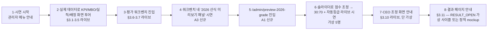

# 대표이사 시연(중간보고) — 1개 사이클 전수 진단 + 추가 계획 (초안)

> **작성일**: 2026-06-14.
> **목적**: "목표등록 → 분류 → 실적 → 평가자 배정 → 자기평가 → 1차 → 2차 → 최종 → 점수(조직30%+개인70%) → 등급 자동산정 → 대표이사 조정·확정 → 결과"까지 끊김 없이 시연.
> **원칙**: 진단·계획까지만. 구현·커밋·push·merge·DB/SQL 실행·flag flip·스키마 변경은 **승인 후**.
> **표기**: 코드/문서에서 확인된 사실만. 불명확 항목은 `[확인 필요]`. prod 데이터 확인은 본 진단에서 미수행 → `[prod SELECT 필요]`.

---

## 0. 안전 원칙 (재확인)

- 공식 쓰기(`Evaluation.totalScore` / `Evaluation.gradeId` 등)는 차단 — `summarizeOfficialWriteHold()`가 모두 `BLOCK` ([src/server/evaluation-2026-official-write-guards.ts](../src/server/evaluation-2026-official-write-guards.ts)).
- 30:70 산식(`finalScoreFormula.active=false`) + 자동등급(`adjustmentRule`/`belowTargetExceptionRule`/`dailyWorkScoringRule`/`aiCapability` 모두 `active=false`)은 **dormant** ([src/lib/evaluation-policy-2026.ts:142](../src/lib/evaluation-policy-2026.ts#L142)).
- Feature flag — `evaluation2026Preview`만 default `true`, 공식 4종(`OfficialScoring/OfficialGrade/AiScoreExclusion/HrApproval`)은 default `false` ([src/lib/feature-flags.ts:60](../src/lib/feature-flags.ts#L60)).
- 시연은 **"미리보기/샘플" 원칙**. 라이브 공식 채점 숫자를 결과로 노출하지 않는다.

---

## 1. 사실 검증 — 사용자가 가정한 현 상태 vs 코드

| 검증 항목 | 사용자 가정 | 코드/문서 결과 | 검증 출처 |
|---|---|---|---|
| 활성 사이클 = "2026년 상반기 평가" (status=`SELF_EVAL`) | 그렇다 | `[prod SELECT 필요]` — 코드에서 단정 불가 (DB row 조회 필요). 사이클명·status는 `EvalCycle.cycleName / status`(`CycleStatus` enum). | [prisma/schema.prisma:671](../prisma/schema.prisma#L671) |
| 평가자 배정 누락 ≈ 289 | 그렇다 | 베이스라인 v1 = `evaluator routing blockers: 289`. 본 진단에서 실시간 조회 미수행. | [docs/AI_EVALUATION_SYSTEM_CONTEXT.md](AI_EVALUATION_SYSTEM_CONTEXT.md), [docs/AI_CURRENT_STATUS.md](AI_CURRENT_STATUS.md) |
| `department_score_intake` 행 수 = 0 (추정) | 그렇다 | `[prod SELECT 필요]`. M1-B PR #80→#81로 schema/route만 main 머지. 모델 존재 ([prisma/schema.prisma:660](../prisma/schema.prisma#L660)). UI(`/admin/department-score-intake`)는 라이브, 작성 행 수는 미확인. | 코드 + 직전 핸드오프 문서 |
| 30:70 산식·자동등급은 dormant, 라이브는 flat weighted-sum | 그렇다 | **확인됨**. `finalScoreFormula.active=false` ([evaluation-policy-2026.ts:142](../src/lib/evaluation-policy-2026.ts#L142)). 라이브 totalScore 계산은 `calcWeightedScore` / `weightedAverage` (legacy). 30:70/자동등급 함수(`calculateFinalPerformanceScore2026`, `calculateAbsoluteGrade2026`)는 ceo-adjust/results에 **wiring 안 됨**. ★ **단 워크벤치 미리보기 walkthrough에는 `localScorePreview`로 30:70 산식 + 자동등급 라벨이 이미 wiring 완료** ([EvaluationWorkbenchClient.tsx:7981-8022](../src/components/evaluation/EvaluationWorkbenchClient.tsx#L7981) — `baseScore = organizationScore × 0.3 + personalScore × 0.7`). 미리보기 전용, 공식 저장 비활성 라벨 부착. | 코드 grep 결과 |
| 공식 쓰기 가드가 `totalScore/gradeId` 공식 쓰기를 BLOCK | 그렇다 | **확인됨**. `evaluateScoreWriteGuard` / `evaluateGradeWriteGuard`가 인프라(schemaBoundary/stagingRehearsal/productionMigration/hrApproval/dbBackup/writeRouteApproved 6종) + 데이터(routing/policyCategory/teamKpi 등) + `priorStagesComplete` 미충족 시 모두 BLOCK. 현 상태에서 모두 `false`로 가정되어 **6개 가드 전부 BLOCK** 예상. | [src/server/evaluation-2026-official-write-guards.ts](../src/server/evaluation-2026-official-write-guards.ts) |
| 시연 파일럿 직원 = 석재원 (jwseok@rsupport.com) | 그렇다 | `[prod SELECT 필요]` — `employees` 테이블에서 사번/role/dept 확인 필요. 이메일 도메인은 `ALLOWED_DOMAIN=rsupport.com` 가정(메모리). | [prisma/seed.ts](../prisma/seed.ts) |
| 회사명 = 알서포트 | 그렇다 | `[prod SELECT 필요]` — `organizations.name`. seed의 기본값은 "(주)샘플기업" — prod와 다름 ([seed.ts](../prisma/seed.ts) 라인 28). | 코드 |

---

## 2. 시연 동선 mermaid

```mermaid
flowchart LR
  S1[1·조직KPI<br/>/kpi/org] --> S2[2·개인MBO<br/>/kpi/personal]
  S2 --> S3[3·분류<br/>/admin/evaluation-readiness<br/>policyCategory]
  S3 --> S4[4·월간실적<br/>/kpi/monthly]
  S4 --> S5[5·평가자배정<br/>/admin/performance-assignments]
  S5 --> S6[6·자기평가<br/>/evaluation/workbench]
  S6 --> S7[7·1차·팀장]
  S7 --> S8[8·2차·실장]
  S8 --> S9[9·최종·본부장]
  S9 --> S10[10·점수<br/>30%+70%]
  S10 --> S11[11·자동등급<br/>thresholdGroup]
  S11 --> S12[12·CEO조정·확정<br/>/evaluation/ceo-adjust]
  S12 --> S13[13·결과<br/>/evaluation/results]
```



---

## 3. 단계별 진단표

> 동작 상태 라벨: 🟢 **라이브** / 🟡 **dormant: 코드 있으나 flag off** / 🛑 **가드로 차단** / ⚪ **미구현**.

### 3.1 조직 KPI 등록 (`/kpi/org`)

| 항목 | 내용 |
|---|---|
| 화면/route | 🟢 존재. 페이지 제목 "조직 KPI" ([src/components/kpi/OrgKpiManagementClient.tsx:1607](../src/components/kpi/OrgKpiManagementClient.tsx#L1607)). |
| 동작 상태 | 🟢 라이브 |
| 모델 | `OrgKpi` — `parentOrgKpiId`(본부KPI 연결), `copiedFromOrgKpiId`(복제), `targetValueT/E/S`(3단 목표). AI 추천: `TeamKpiRecommendationSet/Item`, `TeamKpiReviewRun/Item` (preview-first). |
| 권한 | `ORG_KPI_UPLOAD` — 전체 역할 허용 (scope에 따라 보이는 부서 다름). |
| 시연 데이터 | `[prod SELECT 필요]` — 활성 사이클에 본부 KPI가 등록되어 있는지. Cycle 1 baseline 기준 confirmed KPI는 **1건**(전체 0.3%) — **시연 불가 수준**. |
| 블로커 | 본부 KPI가 없거나 부족하면 시연 시 빈 화면. **시연 전용 가상 사이클에 시드 필요**. |

### 3.2 개인 MBO/KPI 등록 (`/kpi/personal`)

| 항목 | 내용 |
|---|---|
| 화면/route | 🟢 존재. 페이지 제목 "내 KPI/MBO" ([src/components/kpi/PersonalKpiManagementClient.tsx:2449](../src/components/kpi/PersonalKpiManagementClient.tsx#L2449)). |
| 동작 상태 | 🟢 라이브 |
| 모델 | `PersonalKpi` — `OrgKpi` 연결. 작성/제출/검토/확정 워크플로. |
| 권한 | `KPI_SETTING`(전체) + `PERSONAL_KPI_UPLOAD`(`ROLE_ADMIN`/`ROLE_TEAM_LEADER`). |
| 시연 데이터 | `[prod SELECT 필요]`. baseline 기준 MBO missing **284**, confirmed KPI shortage **288** — **거의 모든 직원이 미작성**. |
| 블로커 | 동일 — 가상 사이클에 시연용 MBO 시드 필요. |

### 3.3 분류 — policyCategory (`/admin/evaluation-readiness`)

| 항목 | 내용 |
|---|---|
| 화면/route | 🟢 존재. EvaluationWorkbenchClient 재사용 ([src/app/(main)/admin/evaluation-readiness/page.tsx](../src/app/(main)/admin/evaluation-readiness/page.tsx)). |
| 동작 상태 | 🟢 라이브 (metadata 저장만 — 공식 점수 계산엔 영향 0) |
| 4 카테고리 | `ORG_GOAL / PROJECT_T / PROJECT_K / DAILY_WORK` ([evaluation-policy-2026.ts:4](../src/lib/evaluation-policy-2026.ts#L4)). |
| API | `GET /api/evaluation/preview-2026/mapping-candidates`, `PATCH /api/evaluation/preview-2026/policy-metadata` ([src/app/api/evaluation/preview-2026/](../src/app/api/evaluation/preview-2026/)). |
| 시연 데이터 | baseline: `policyCategory missing: 1` — 거의 모두 분류 완료된 상태 추정. `[prod SELECT 필요]`. |
| 블로커 | 없음. 단 분류는 미리보기/metadata일 뿐, 실제 점수 계산엔 cutover 후 wiring 필요. |

### 3.4 월별 실적 (`/kpi/monthly`)

| 항목 | 내용 |
|---|---|
| 화면/route | 🟢 존재. 페이지 제목 동적(`monthContext.screenTitle`) ([src/components/kpi/MonthlyKpiManagementClient.tsx:1132](../src/components/kpi/MonthlyKpiManagementClient.tsx#L1132)). |
| 동작 상태 | 🟢 라이브 |
| 모델 | `MonthlyRecord`. 달성률 자동 계산 — `calcAchievementRate(actual, target)` ([src/lib/utils.ts:73](../src/lib/utils.ts#L73)). |
| 권한 | `MONTHLY_INPUT` — `ROLE_ADMIN/TEAM_LEADER/MEMBER`. |
| 시연 데이터 | `[prod SELECT 필요]`. baseline 명시 없음 — Cycle 1이 상반기 초기라 월간 실적 누적 거의 0 추정. |
| 블로커 | 시연 시 달성률 그래프가 비어 보일 가능성. 가상 사이클에 1~5월 월간 데이터 시드 필요. |

### 3.5 평가자 배정 (`/admin/performance-assignments`)

| 항목 | 내용 |
|---|---|
| 화면/route | 🟢 존재. 제목 "평가 배정 관리" / "평가 배정 운영" ([src/components/admin/PerformanceAssignmentAdminClient.tsx:183](../src/components/admin/PerformanceAssignmentAdminClient.tsx#L183)). |
| 동작 상태 | 🟢 라이브 |
| 서버 함수 | `syncPerformanceAssignmentsForCycle`, `upsertPerformanceAssignment`, `resetPerformanceAssignmentToAuto`, `resolveEvaluationStageAssignee` ([src/server/evaluation-performance-assignments.ts:705](../src/server/evaluation-performance-assignments.ts#L705)). |
| 매핑 룰 | FIRST=팀장 / SECOND=실장 / FINAL=본부장 (matrix). 자동 배정 알고리즘 상세 `[확인 필요 — resolveEvaluationStageAssignee 본문]`. |
| 시연 데이터 | baseline: evaluator routing blockers **289** = **거의 전 직원 누락**. |
| 블로커 | ★ **시연 핵심 빈틈** — 시연 직전에 가상 5명의 평가자를 정리해두지 않으면 자기평가 화면이 빈 상태. |

### 3.6 자기평가 (SELF) — `/evaluation/workbench`

| 항목 | 내용 |
|---|---|
| 화면/route | 🟢 존재. 제목 "성과평가" / "2026 평가 워크벤치 미리보기" ([src/components/evaluation/EvaluationWorkbenchClient.tsx:1647](../src/components/evaluation/EvaluationWorkbenchClient.tsx#L1647), [:7812](../src/components/evaluation/EvaluationWorkbenchClient.tsx#L7812)). |
| 동작 상태 | 🟢 라이브 (작성·제출·반려는 정상) |
| 모델 | `Evaluation` + `EvaluationItem`. `EvalStage=SELF`, `EvalStatus=PENDING→IN_PROGRESS→SUBMITTED`. |
| 공식 쓰기 가드 | `evaluateSelfStageSaveGuard` — 인프라(6) + 데이터(routing/policyCategory/teamKpi/MBO/officialGate) 미충족이면 BLOCK. 단 본 가드는 **공식 저장에만 적용**, draft/임시 저장은 라이브. `[확인 필요 — 라우트가 가드를 실제로 enforce하는지 grep]`. |
| 블로커 | 평가자 배정이 없으면 본 화면이 빈 상태. |

### 3.7 1차/2차/최종 평가 (FIRST/SECOND/FINAL) — `/evaluation/workbench`

| 항목 | 내용 |
|---|---|
| 화면/route | 동일 화면. 평가자 역할에 따라 단계 표시. |
| 동작 상태 | 🟢 라이브 (작성·제출·반려·draft·submit 모두) |
| 가감점 입력 | 🟡 **dormant** — `shouldApplyAdjustmentRule2026` = false (rule.active=false) ([evaluation-scoring-2026.ts:372](../src/server/evaluation-scoring-2026.ts#L372)). 입력해도 totalScore에 비트단위 변화 0. |
| DAILY_WORK 80 cap | 🟢 **active enforced** — draft·submit 양쪽 라우트 wiring 완료 ([api/evaluation/[id]/route.ts:128](../src/app/api/evaluation/[id]/route.ts#L128), [api/evaluation/[id]/submit/route.ts:160](../src/app/api/evaluation/[id]/submit/route.ts#L160)). 80 초과 시 `DAILY_WORK_SCORE_EXCEEDS_MAX` 에러로 400 차단 ([evaluation-scoring-2026.ts:201](../src/server/evaluation-scoring-2026.ts#L201)). dailyWorkScoringRule 본체는 dormant지만 cap만 별도 적용됨. |
| 가중치 cap | 🟡 dormant — `weightRule.enforced=false`. PR #74로 라우트 wiring 완료 (warning 수준). |
| 미달예외 | 🟡 dormant — `belowTargetExceptionRule.active=false`. effective score = 원본 score ([evaluation-scoring-2026.ts:632](../src/server/evaluation-scoring-2026.ts#L632)). |
| 블로커 | 평가 자체는 라이브로 진행됨. 단 화면에 "조정점수 입력" UI는 있으나 cutover 전이라 점수 반영 0 → 시연 시 혼란 가능. |

### 3.8 점수 (조직30%+개인70%) — ★ 시연 핵심 빈틈

| 항목 | 내용 |
|---|---|
| 함수 | `calculateFinalPerformanceScore2026({ organizationPerformanceScore, personalPerformanceScore })` — `org × 30% + personal × 70%` ([evaluation-scoring-2026.ts:450](../src/server/evaluation-scoring-2026.ts#L450)). |
| 정책 | `finalScoreFormula.active = false` ([evaluation-policy-2026.ts:142](../src/lib/evaluation-policy-2026.ts#L142)). |
| 호출처 | grep 결과 `calculateFinalPerformanceScore2026`/`calculateEvaluationScore2026` 호출처는 **`evaluation-scoring-2026.ts`(자기), `evaluation-2026-end-to-end-pilot.ts`, `evaluation-preview-2026.ts`, `evaluation-ai-policy-2026.ts`** 4곳. ★ **추가**: 워크벤치의 `InteractivePilotWalkthrough2026`이 `localScorePreview`로 30:70 산식을 직접 구현·노출 중([EvaluationWorkbenchClient.tsx:8000](../src/components/evaluation/EvaluationWorkbenchClient.tsx#L8000)) — 미리보기 전용, 공식 저장 비활성. CEO·결과 페이지는 호출 안 함. |
| 동작 상태 | 🟡 **dormant + 시연 화면 부재** — 함수는 있으나 시연 동선의 UI에서 노출되지 않음. |
| 조직 30% 입력원 | `department_score_intakes` 테이블 (CHECK 0~130) + `/admin/department-score-intake`. 행 수 `[prod SELECT 필요]`. |
| 조직 가중치 helper | `resolveOrganizationWeights2026(cycleConfig)`, default `{withSection: {division:0, section:0.1, team:0.2}, withoutSection: {division:0.1, team:0.2}, personal:0.7}` ([src/lib/policy-2026-organization-weights.ts](../src/lib/policy-2026-organization-weights.ts)). M1-C로 main 머지 완료 (PR #83). |
| 블로커 | ★ **시연 동선상 "30:70 + 가중치" 결과를 보여줄 화면이 없음**. 대화 직전 작업이던 `/admin/preview-2026-grade` 페이지가 정확히 이 빈틈을 메우려던 안. |

### 3.9 등급 자동산정 — ★ 시연 핵심 빈틈

| 항목 | 내용 |
|---|---|
| 함수 | `calculateAbsoluteGrade2026({ score, thresholdGroup?, salesGroup?, roleGroup?, teamMemberSalesThresholdDecision? })` ([evaluation-grade-2026.ts:321](../src/server/evaluation-grade-2026.ts#L321)). |
| 정책 | `gradeThresholdGroups` 5그룹 × 6등급 (`SUPER/OUTSTANDING/EXCELLENT/GOOD/NEED_IMPROVEMENT/UNSATISFACTORY`). `TEAM_MEMBER_SALES`의 SUPER/OUTSTANDING 경계는 110에서 중첩 — HR 확정 필요. |
| 호출처 | preview/pilot 모듈 + **워크벤치 `InteractivePilotWalkthrough2026`의 `getInteractivePilotGradeLabel2026`로 등급 라벨 산출** ([EvaluationWorkbenchClient.tsx:8022](../src/components/evaluation/EvaluationWorkbenchClient.tsx#L8022)). CEO·결과 페이지는 호출 안 함. |
| 동작 상태 | 🟡 **dormant + 시연 화면 부재**. |
| 블로커 | ★ 시연 시 "이 직원의 점수 92점 → 자동등급 EXCELLENT" 보여줄 라이브 화면이 없음. |
| 보완책 | `/admin/preview-2026-grade` 페이지(작업 중단)가 정확히 이 빈틈을 메움. |

### 3.10 CEO 조정·확정 (`/evaluation/ceo-adjust`)

| 항목 | 내용 |
|---|---|
| 화면/route | 🟢 존재. 제목 "대표이사 확정" ([src/components/evaluation/EvaluationCeoFinalClient.tsx:724](../src/components/evaluation/EvaluationCeoFinalClient.tsx#L724)). |
| 동작 상태 | 🟢 라이브 (단 등급 산정 베이스는 레거시 `GradeSetting` 기반 추정) |
| 권한 | `GRADE_ADJUST` — `ROLE_ADMIN` / `ROLE_CEO`. |
| 서버 함수 | `getEvaluationCeoFinalPageData`, `buildCeoFinalDivisionGroups`, `buildCeoFinalSummary` ([src/server/evaluation-ceo-final-page.ts](../src/server/evaluation-ceo-final-page.ts)). |
| 공식 쓰기 가드 | `evaluateFinalizationGuard` — `ceoApprovalCollected` + 모든 선행 가드 OK 필요. 현 상태 BLOCK. `[확인 필요 — 라우트 enforce]`. |
| Calibration | **별도 calibration 메뉴 없음** — `/evaluation/ceo-adjust` 페이지가 `getEvaluationCeoFinalPageData`를 통해 calibration 데이터를 함께 로드 ([src/server/evaluation-ceo-final-page.ts](../src/server/evaluation-ceo-final-page.ts) + [src/server/evaluation-calibration.ts](../src/server/evaluation-calibration.ts)). navigation·permissions에 `calibration` 키워드 0건. |
| 2026 자동등급 wiring | 호출 안 됨. CEO가 보는 등급은 레거시 기준. |
| 블로커 | 시연 가능. 단 "조정 전 자동등급 (2026 기준)" → "조정 후 등급" 비교를 보여주려면 별도 패널 필요. |

### 3.11 결과 (`/evaluation/results`)

| 항목 | 내용 |
|---|---|
| 화면/route | 🟢 존재. 제목 "평가 결과" ([src/components/evaluation/EvaluationResultsClient.tsx:314](../src/components/evaluation/EvaluationResultsClient.tsx#L314)). |
| 동작 상태 | 🟢 라이브 |
| 권한 | `EVAL_RESULT` — 전체 역할. |
| 서버 함수 | `getEvaluationResultsPageData` ([src/server/evaluation-results.ts](../src/server/evaluation-results.ts)). |
| 시연 데이터 | 사이클이 `RESULT_OPEN` 상태가 되어야 결과 공개. 현재 `SELF_EVAL` 추정 — **상태 전이 없이는 시연 불가**. |
| 블로커 | ★ 시연 직전에 가상 사이클을 인위적으로 `RESULT_OPEN`까지 진행시켜야 함 → 별도 시연 시드 사이클 필요. |

---

## 4. 공식 쓰기 가드 — 현 상태 예상

`summarizeOfficialWriteHold(input)` 6 가드 상태 (현 시점 추정):

| 가드 | 예상 상태 | 주요 BLOCK 사유 |
|---|---|---|
| `officialPopulation` | 🛑 BLOCK | 인프라 6 + 데이터(MBO 284 / KPI shortage 288 / routing 289 / officialGate 1753 / policyCategory 1) |
| `selfStageSave` | 🛑 BLOCK | population과 동일 |
| `reviewerStageSave` | 🛑 BLOCK | + evaluator routing + leader evaluation |
| `scoreWrite` | 🛑 BLOCK | + `scorePolicyBlockers` + `aiAnnualScoreExcluded≠true` + `priorStagesComplete≠true` |
| `gradeWrite` | 🛑 BLOCK | + `gradePolicyBlockers` + `scoreWriteComplete≠true` + finalization CEO blocker |
| `finalization` | 🛑 BLOCK | + `gradeWriteComplete≠true` + `ceoApprovalCollected≠true` |

> 시연 시 가드 통과 시도는 **금지** — feature flag flip + 데이터 정비 + HR/CEO 승인이 모두 필요한 거대 작업. 시연은 가드를 우회하지 않고 **미리보기 화면**으로 대체한다.

---

## 5. 갭 요약 — 시연이 막히는 4가지 빈틈

| # | 빈틈 | 영향 단계 | 본질 |
|---|---|---|---|
| G1 | 시연용 데이터 부재 (가상 사이클 + 가상 직원 5명 + KPI/MBO/실적/평가자) | §3.1–3.5 | prod 시드는 "샘플기업" 데모용, 실제 cycle 1은 거의 비어 있음 |
| G2 | 30:70 + 자동등급 결과를 보여줄 전용 보강 화면이 필요 | §3.8–3.9 | ★ **워크벤치 `localScorePreview`로 30:70+자동등급 wiring 완료** (미리보기 전용, 공식 저장 비활성). G2 빈틈 거의 채워짐 — A1은 보강·시각화 역할(5 페르소나로 스펙트럼 가시화·시연용 안내) |
| G3 | 사이클 상태 `RESULT_OPEN`까지 진행된 가상 사이클 부재 | §3.11 | 결과 페이지 시연 불가능 |
| G4 | "라이브 점수(레거시)" vs "2026 미리보기 점수"의 시연용 라벨링 부재 | §3.6–3.11 | 시연자/관객 혼란 위험 |

---

## 6. (A) 안전한 시연-인에이블 추가 — 공식 가드/스키마/prod DB 미터치

> 각 항목: **무엇을 / 어디에 / 왜 / 어느 빈틈을 메우나**.

### A1. 시연 미리보기 페이지 — `/admin/preview-2026-grade` (직전 작업 재개)
- **무엇**: 슬라이더로 점수 입력 → 30:70 산식 → `calculateAbsoluteGrade2026` 호출 → 등급 자동표시. 가상 5명(본부장/팀장영업/실장비영업/팀원비영업/본부직속팀원) 카드.
- **어디에**: 신규 파일 — `src/lib/preview-2026-organization-score.ts`(resolver), `src/server/preview-2026-grade-page.ts`(loader), `src/app/(main)/admin/preview-2026-grade/page.tsx`, `src/components/admin/Preview2026GradeAdminClient.tsx`. 추가로 `src/types/auth.ts`의 `MENU_KEYS`, `src/lib/auth/permissions.ts`, `src/lib/navigation.ts`에 메뉴 등록.
- **왜**: G2·G3을 한 번에 해결. **DB 조회 0 (가상 5명 코드 상수)**, read-only, ROLE_ADMIN 한정.
- **시연 동선**: §3.8·3.9·3.11 빈틈을 메움. 시연자가 "점수 → 자동등급" 시연을 라이브로 보여줄 수 있음.
- **위험도**: 매우 낮음 — pure function + read-only page. 공식 쓰기 0.
- **선행 작업**: 직전 핸드오프 문서 + `preview-2026-grade-impl-plan.md`의 §5 명세 그대로.

### A2. 시연용 가상 사이클 시드 스크립트 (read-only DB가 아닌 별도 cycle, 또는 dry-run only)
- **무엇**: "시연 사이클 2026 (DEMO)" 사이클 + 가상 5명 직원 + 본부 KPI 3건 + 개인 MBO 5×3건 + 1~5월 월간 실적 + 평가자 배정 + 1차/2차/최종 SUBMITTED 상태까지 작성된 시드.
- **어디에**: 신규 파일 — `scripts/seed-demo-cycle-2026.ts` (별도 사이클 cuid + 별도 사번 prefix `DEMO-`). `tsconfig.seed.json`로 ts-node 실행.
- **왜**: G1·G3을 해결.
- **시연 동선**: 모든 단계 §3.1–3.11이 라이브로 동작.
- **★ 위험도**: 🟡 **중간** — prod DB에 INSERT 발생. 단 격리된 사이클/직원이라 기존 데이터에 영향 0. 그러나:
  - **사용자 안전 원칙 "prod DB 쓰기 금지"와 충돌**.
  - 단순 INSERT라도 prod DB writes에 해당하므로 **승인 후 진행** 필요.
  - **대안**: 시연을 위한 별도 staging DB / `db_pms_demo` 스키마 분리. 단 staging이 없다고 가정(메모리).
- **권장**: **본 항목은 (B) 영역으로 이동시켜 별도 승인 받는 것이 맞음**. 또는 A4(고정 fixture JSON) 대체.

### A3. 워크벤치 미리보기 영역에 "2026 산식 미리보기 패널" 추가 (read-only)
- **무엇**: `/evaluation/workbench` 페이지 "2026 평가 워크벤치 미리보기"(라인 7812) 영역에 패널 1개 추가 — 현재 evaluation의 itemScores를 입력으로 `calculateEvaluationScore2026` + `calculateAbsoluteGrade2026` 호출 → org/personal/final/grade 표시. **공식 점수와 분리 라벨**(`PREVIEW`).
- **어디에**: `src/components/evaluation/EvaluationWorkbenchClient.tsx` 라인 7812 근처에 패널 추가. server 쪽은 `src/server/evaluation-workbench.ts`에서 미리보기 데이터 산출.
- **왜**: G2·G4 해결. 실제 사이클 데이터(가상이든 진짜든)로 2026 산식을 라이브로 보여줌.
- **시연 동선**: §3.8·3.9 빈틈을 워크벤치 안에서 메움. 시연자가 "이 직원의 자기평가 점수가 OO이고, 2026 산식 적용 시 등급은 OO"을 라이브로 시연.
- **위험도**: 🟢 낮음 — pure 함수 호출만 추가. DB 쓰기 0.
- **주의**: workbench 클라이언트가 7800줄대로 매우 큼 → 추가 영역 찾기 어려울 수 있음. `[확인 필요 — 라인 7812 부근 구조]`.

### A4. 시연용 read-only fixture JSON
- **무엇**: 가상 5명의 KPI/MBO/실적/평가/점수 결과를 JSON 파일로 저장. `/admin/preview-2026-grade`(A1)나 별도 시연 페이지가 이 JSON을 import해서 렌더.
- **어디에**: `src/data/demo/demo-cycle-2026.json` + 별도 로더.
- **왜**: G1을 prod DB 쓰기 없이 해결.
- **시연 동선**: 단계별 시연용 데모 페이지에서 "이건 가상 데이터" 라벨 부착.
- **위험도**: 🟢 매우 낮음. fixture만 추가.
- **trade-off**: 실제 시스템 흐름(작성→제출→반려 등 UX)을 보여주지 못함. **점수·등급 결과 시연에만 적합**.

### A5. 시연자용 워크스루 문서 (`docs/시연_스크립트_대표이사.md`)
- **무엇**: 단계별 화면 이동 + 마우스 클릭 시나리오 + 시연 멘트 + Q&A 대응 답변.
- **어디에**: 신규 파일 — `docs/시연_스크립트_대표이사.md`.
- **왜**: 시연자의 실수/혼란 최소화. G4 해결 (라벨링).
- **시연 동선**: 13단계 모두.
- **위험도**: 🟢 매우 낮음. 문서만.

### A6. 임퍼소네이션(masterLogin)으로 가상 본부장/팀장/팀원 시연
- **무엇**: 가상 5명을 prod에 시드(A2) 또는 fixture(A4) 기반으로, ROLE_ADMIN이 `masterLoginPermissionGranted=true` 직원에 임퍼소네이션해서 각 역할별 화면 시연.
- **어디에**: 기존 `masterLogin` 기능 활용 ([src/types/auth.ts:64](../src/types/auth.ts#L64)). 단 가상 직원이 DB에 있어야 함 — A2 또는 fixture mock.
- **왜**: "팀원이 본 화면", "팀장이 본 화면", "본부장이 본 화면" 시연 가능.
- **위험도**: 🟡 — `masterLoginPermissionGranted` 직원이 prod에 있어야 함. **이미 메모리에 master-login·임퍼소네이션 구현 완료** 명시.
- **권장**: A1+A3 만으로 시연 충분 → 본 항목은 시연 깊이가 필요할 때만.

---

## 7. (B) 승인 필요 — 스키마/DB 변경·flag flip·공식 쓰기

> **★ 모두 임의 실행 금지. 대표 시연엔 비권장.**

| 항목 | 동작 | 위험도 | 시연 권장? |
|---|---|---|---|
| B1. `evaluation2026OfficialScoring/Grade` flag flip | 공식 점수/등급 계산 활성화 | 🚨 매우 높음 — 가드 통과 + HR/CEO 승인 + 데이터 정비 모두 필요 | ❌ 비권장. 1회용 시연을 위해 cutover를 앞당기는 것은 부적절. |
| B2. `EVALUATION_2026_PREVIEW_ENABLED=true` 보장 | 코드 default `true` ([feature-flags.ts:65](../src/lib/feature-flags.ts#L65)) — env 미설정 시 활성. 명시 `false`만 비활성. | 🟢 낮음 — default true라 변경 보통 불필요 | 확인 완료 (env 값 자체는 노출 금지) |
| B3. prod에 시연용 가상 사이클/직원 INSERT (A2를 prod로) | 격리된 cuid/사번이라도 prod에 row 추가 | 🟡 중간 — INSERT만이라도 책임 발생. 사후 정리 부담 | ❌ 비권장. A1+A3+A4 조합으로 대체. |
| B4. `department_score_intake` 시연 데이터 INSERT | M1-B1으로 schema/route는 prod에 있으나 행 수 0 (추정) | 🟡 중간 — INSERT 1~5건 | ❌ 비권장. preview 페이지(A1)의 가상 5명 코드 상수로 대체. |
| B5. 시연 직전 prod에서 routing blocker 일괄 해소 (자동 배정 sync 실행) | `syncPerformanceAssignmentsForCycle` 호출 → EvaluationAssignment INSERT/UPDATE | 🟠 높음 — 평가자 매핑이 가상이 아닌 실제 직원으로 진행될 수 있음. 평가 사이클이 SELF_EVAL 상태에서 INSERT는 의도된 운영 흐름이지만 시연 시점에 일괄 실행하면 운영팀 혼란 | ❌ 비권장. 시연용이 아닌 운영 작업으로 분리. |
| B6. cutover 일정 앞당김 (2026-07-01 → 시연일) | flag 4종 flip + schema migration + HR 승인 일정 단축 | 🚨 매우 높음 | ❌ 비권장. |
| B7. master-login 권한 부여 (가상 직원에) | `masterLoginPermissionGranted=true` UPDATE | 🟡 중간 | ❌ 시연용은 비권장. 운영 권한 관리는 별도. |

---

## 8. ★ 권장 시연 경로 (가장 안전한 1개 안)

### 8.1 권장: **A1 + A3 + A5 조합 — "미리보기 페이지 중심" 시연**



**시연 단계별 사용 화면**:

| 단계 | 화면 | 데이터 출처 | 라벨 |
|---|---|---|---|
| 목표등록(조직) | `/kpi/org` | 실제 활성 사이클 (또는 가상) | 라이브 |
| 목표등록(개인) | `/kpi/personal` | 실제 데이터 | 라이브 |
| 분류 | `/admin/evaluation-readiness` | 실제 baseline | 라이브 |
| 실적 | `/kpi/monthly` | 실제 (또는 dry-run) | 라이브 |
| 배정 | `/admin/performance-assignments` | 실제 (또는 baseline 표시) | 라이브 |
| 자기/1차/2차/최종 | `/evaluation/workbench` | 실제 또는 임퍼소네이션 | 라이브 |
| **★ 점수 + 등급 (30:70)** | **`/admin/preview-2026-grade` (A1)** | **가상 5명 코드 상수** | **PREVIEW** |
| CEO 조정 | `/evaluation/ceo-adjust` | 실제 또는 정적 캡처 | 라이브 또는 mockup |
| 결과 | `/evaluation/results` | `[확인 필요 — RESULT_OPEN 가상 사이클 필요한지]` | 라이브 또는 mockup |

### 8.2 trade-off

| 경로 | 장점 | 단점 |
|---|---|---|
| **권장: 미리보기 중심 (A1+A3+A5)** | DB write 0, 가드 우회 없음, 정리 부담 0, 1주 이내 구현 가능 | 점수·등급 단계는 "라이브 시스템 흐름"이 아닌 별도 미리보기 화면. 일부 흐름은 mockup. |
| 대안: 실제 가상 사이클 (A2) | 전 단계 라이브 동작 | DB 쓰기 발생 (승인 필요), 사후 정리 부담, 데이터 격리 검증 필요 |
| 대안: cutover 앞당김 (B6) | 시연을 실제 공식 시스템으로 진행 | 매우 위험 — 시연용 일정 단축은 부적절 |

### 8.3 점수·등급 단계 — 구체적으로 무엇을 어떻게

★ **A1 페이지 사용 시 — 화면 구성 안**:

```
┌─ /admin/preview-2026-grade ───────────────────────────────────┐
│ [헤더] 2026 평가 미리보기 — 점수·등급 자동산정 (PREVIEW)       │
│                                                               │
│ ┌─ 가상 직원 5명 ──────────────────────────────────────────┐   │
│ │ 카드1. 가상_본부장 (DIVISION_HEAD)                      │   │
│ │   조직 점수(team)  [슬라이더 0-130]: 126                │   │
│ │   조직 점수(parent)[슬라이더 0-130]: 124                │   │
│ │   개인 점수       [슬라이더 0-100]: 122                │   │
│ │   → final = 122.0  / 등급 = SUPER                       │   │
│ │                                                          │   │
│ │ 카드2~5 (팀장영업/실장비영업/팀원비영업/본부직속팀원)   │   │
│ └─────────────────────────────────────────────────────────┘   │
│                                                               │
│ ┌─ 정책 안내 패널 ────────────────────────────────────────┐   │
│ │ ▸ 산식: 조직 × 30% + 개인 × 70%                        │   │
│ │ ▸ 가중치: withSection {div 0, sec 0.1, team 0.2}        │   │
│ │ ▸ 등급 임계값 5그룹 표                                  │   │
│ │ ▸ "dormant" 안내 — 현재 라이브 점수와 무관              │   │
│ └─────────────────────────────────────────────────────────┘   │
└───────────────────────────────────────────────────────────────┘
```

- **데이터 소스**: 코드 상수 (DB 조회 0). 직전 핸드오프의 가상 5명 표 그대로.
- **함수 호출**: `previewOrganizationScore2026({ employee, departments, intakesByDeptId, weights })` → `calculateAbsoluteGrade2026({ score, roleGroup, salesGroup })`.
- **라벨**: 항상 "PREVIEW" 노란 배지. "이 화면의 점수는 라이브 공식 점수가 아닙니다" 고정 텍스트.

---

## 9. 사전 확인 필요 항목 (시연일 전)

| # | 항목 | 방법 | 책임 |
|---|---|---|---|
| C1 | 활성 사이클 명/상태 확정 | `[prod SELECT 필요]` `SELECT id, cycleName, status FROM eval_cycles WHERE status != 'CLOSED' ORDER BY createdAt DESC LIMIT 5` | HR |
| C2 | 시연 파일럿 석재원 정보(사번/role/dept) | `[prod SELECT 필요]` `SELECT empId, empName, position, role, deptId FROM employees WHERE gwsEmail = 'jwseok@rsupport.com'` | HR |
| C3 | 회사명/조직명 | `[prod SELECT 필요]` `SELECT id, name, fiscalYear FROM organizations` | HR |
| C4 | `department_score_intake` 행 수 | `[prod SELECT 필요]` `SELECT count(*) FROM department_score_intakes` | 엔지니어링 |
| C5 | workbench 라인 7812 "2026 미리보기" 영역에 어떤 점수가 노출되는지 | ✅ **확인 완료** — `InteractivePilotWalkthrough2026`이 `localScorePreview`로 organizationScore(ORG_GOAL 가중평균) + personalScore(PERSONAL 가중평균 × 0.7 + reviewer 평균 × 0.3) → `baseScore = org × 0.3 + personal × 0.7` ([EvaluationWorkbenchClient.tsx:7981-8022](../src/components/evaluation/EvaluationWorkbenchClient.tsx#L7981)) + 가감점 적용 + 등급 라벨 산출. 미리보기 전용, 공식 저장 비활성. | 엔지니어링 |
| C6 | `evaluation2026Preview` flag .env 값 | ✅ **확인 완료** — 코드 default `true` ([feature-flags.ts:65](../src/lib/feature-flags.ts#L65)). env 미설정 시 활성. 외부 참조 0건(feature-flags.ts 내부 helper만 사용). 실제 env 값은 비공개. | 엔지니어링 |
| C7 | DAILY_WORK 80 cap이 라우트에 enforce되는지 | ✅ **확인 완료** — draft·submit 양쪽 라우트에 wiring됨 ([api/evaluation/[id]/route.ts:128](../src/app/api/evaluation/[id]/route.ts#L128), [submit/route.ts:160](../src/app/api/evaluation/[id]/submit/route.ts#L160)). `DAILY_WORK_SCORE_EXCEEDS_MAX` 에러로 400 차단 ([evaluation-scoring-2026.ts:201](../src/server/evaluation-scoring-2026.ts#L201)). | 엔지니어링 |
| C8 | calibration 메뉴 경로 등록 여부 | ✅ **확인 완료** — **별도 calibration 메뉴 없음**. `/evaluation/ceo-adjust` 1개 경로로 통합 ([navigation.ts:61](../src/lib/navigation.ts#L61), `GRADE_ADJUST` 권한 ROLE_ADMIN+ROLE_CEO). calibration 로직은 ceo-final 페이지 로더가 함께 호출. | 엔지니어링 |

---

## 10. 우선순위 추천 (A 항목 중 어느 것부터 진행할지)

> 사용자 결정 사항. 본 진단은 추천만 남기고 STOP.

| 순위 | 항목 | 이유 |
|---|---|---|
| **1순위** | **A1. `/admin/preview-2026-grade` 페이지 (직전 작업 재개)** | • G2·G3 핵심 빈틈을 한 번에 메움<br>• 직전 대화에서 Phase 0 결정 완료, Phase 1(resolver)부터 바로 진행 가능<br>• `preview-2026-grade-impl-plan.md` 명세 존재<br>• DB write 0, 가장 안전<br>• 시연 동선 §3.8·3.9의 가장 큰 빈틈 직접 해결 |
| 2순위 | A5. 시연 워크스루 문서 | • 1순위와 병행 작성 가능 (문서만)<br>• 시연자가 사전 리허설 가능 |
| 3순위 | A3. 워크벤치 내 2026 미리보기 패널 | • A1보다 wiring 범위 더 큼 (7800줄 클라이언트 수정)<br>• 시연 시 "라이브 워크벤치 안에서 미리보기" 효과<br>• A1 완성 후 시간 여유 있을 때 |
| 4순위 | A4. fixture JSON | • A1로 가상 5명 이미 코드 상수화되면 추가 가치 낮음<br>• 만약 더 큰 가상 시연 데이터(20명+) 필요할 때만 |
| **비권장** | A2/A6 (DB 쓰기 동반) | • prod 쓰기 위험. 시연 1회를 위해 정리 부담 큼.<br>• B 영역으로 분류해 별도 승인 |

---

## 11. STOP — 다음 결정 요청

★ 본 진단은 **여기서 멈춘다**. 다음 중 선택 후 알려주세요:

- (a) **1순위 — A1 (`/admin/preview-2026-grade`)부터 시작**: 직전 대화의 Phase 1(`previewOrganizationScore2026` resolver pure function + 단위 테스트)을 재개. → 새 브랜치 생성, resolver + 테스트 작성, 보고 후 멈춤.
- (b) **A5 (시연 워크스루 문서)부터 시작**: 코드 변경 0. 시연 동선·멘트·Q&A 답변을 markdown으로 작성.
- (c) **A1 + A5 병행**: 동일 세션에서 코드 + 문서 동시.
- (d) **C1–C8 사전 확인부터**: prod SELECT 8건을 사용자가 직접 또는 운영팀에 위임해서 채워온 후 진단표를 업데이트.
- (e) 그 외 — 다른 항목 또는 우선순위 재조정.

★ **구현 시작 전 추가 검증이 필요하면** 항목 번호와 함께 알려주세요. 현 시점에서 진단·계획만 작성 완료.

---

> 📂 **본 문서 위치**: [docs/시연_사이클_진단.md](시연_사이클_진단.md)
> 📂 **관련 문서**:
> - 직전 핸드오프 — Phase 0 결정 + 가상 5명 표 + Phase 1~5 진행 계획.
> - [docs/관리자_매뉴얼_draft.md](관리자_매뉴얼_draft.md) — 시스템 라이프사이클 기준.
> - [docs/AI_EVALUATION_SYSTEM_CONTEXT.md](AI_EVALUATION_SYSTEM_CONTEXT.md) — Cycle 1 baseline.
> - [docs/AI_SAFETY_GUARDRAILS.md](AI_SAFETY_GUARDRAILS.md) — 금지 행동 목록.
> - `preview-2026-grade-impl-plan.md` — A1 구현 명세 (repo root 가정 `[확인 필요 — 정확한 위치]`).
